# Securing Node.js Express REST APIs and Next.js with Keycloak

## Overview

Keycloak is an open-source identity and access management solution which makes it easy to secure modern applications and services with little to no code.

<br />

<details>
<summary>
Keycloak environment with Docker + Docker Compose
</summary>

After having cloned the repository, just access it and enter the Keycloak environment folder, and run the environments with Docker compose.

```bash
$ cd keycloak-nextjs-nodejs
$ cd docker/keycloak
$ docker-compose up -d
```

Now go to http://localhost:8080 and see if Keycloak opens in your browser.

</details>

<details>
<summary>
Keycloak Settings
</summary>

### Create Realm

A `Realm` manages a set of users, credentials, roles, and groups. A user belongs to and logs into a realm. Realms are isolated from one another and can only manage and authenticate the users that they control.

1. Go to http://localhost:8080/auth/admin and log in to the Keycloak Admin Console using the admin credentials, by default the user is `admin` and the password is `admin`.
2. From the `Master` drop-down menu, click `Add Realm`. When you are logged in to the master realm this drop-down menu lists all existing realms.
3. Type `apps` in the `Name` field and click `Create`.

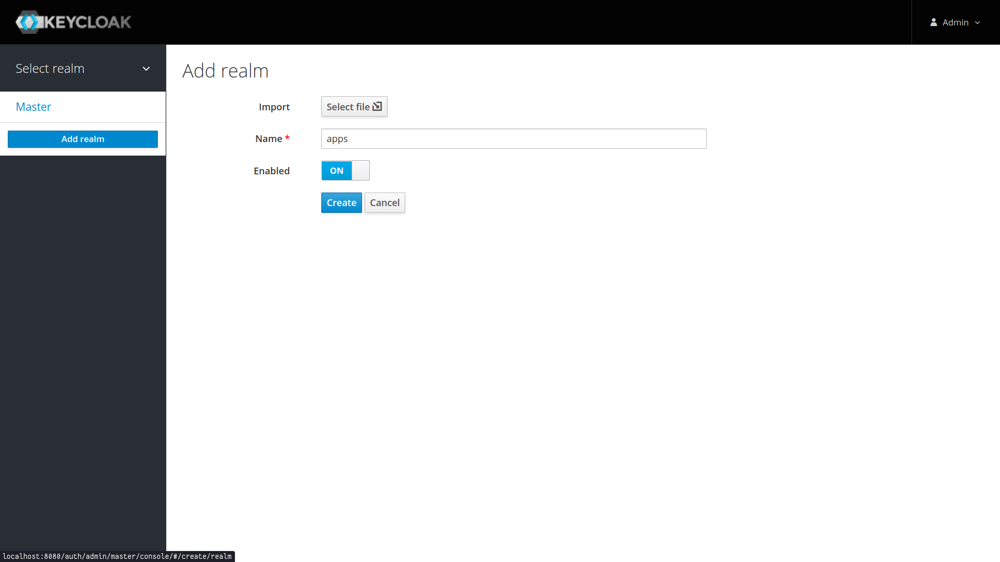

When the realm is created, the main admin console page opens. Notice the current realm is now set to `apps`. Switch between managing the `master` realm and the realm you just created by clicking entries in the `Select realm` drop-down menu.

Make sure `apps` is selected for the below configurations. Avoid using the master realm. You don’t have to create the realm every time. It’s a one time process.

### Create Clients

Clients are entities that can request Keycloak to authenticate a user. Most often, clients are applications and services that want to use Keycloak to secure themselves and provide a single sign-on solution. Clients can also be entities that just want to request identity information or an access token so that they can securely invoke other services on the network that are secured by Keycloak.

1. Click on the `Clients` menu from the left pane. All the available clients for the selected Realm will get listed here.

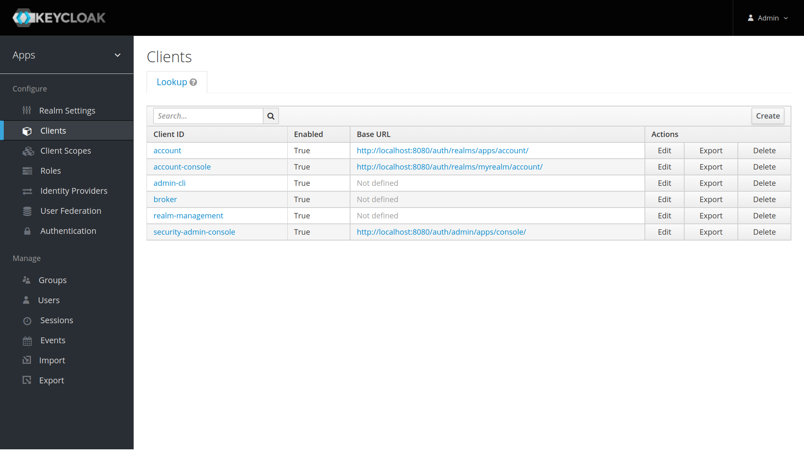

2. To create a new client, click `Create`. You will be prompted for a `Client ID`, a `Client Protocol` and a `Root URL`. A good choice for the client ID is the name of your application, the client protocol should be set to `openid-connect` and the root URL should be set to the application URL.

#### Create Node.js Client

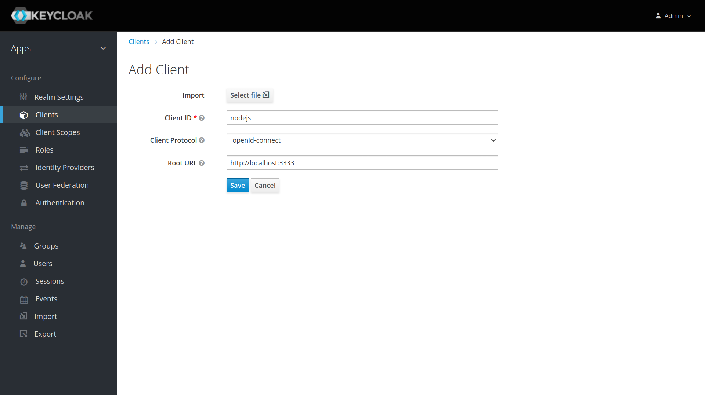

After saving you will be presented with the client configuration page where you can assign a name and description to the client if desired.

Set the **Access Type** to `confidential`, **Authorization Enabled** to `ON`, `Service Account Enabled` to `ON` and click `Save`.


`Credentials` tab will show the `Client Secret` which is required for the Node.js Application Keycloak configurations.


Go to `Client Roles` tab to create the `nodejs` role definitions. Imagine the Application that you are building with have different types of users with different user permissions. Ex: users and administrators.

- Some APIs would only be accessible to users only.
- Some APIs would be accessible to administrators only.
- Some APIs would be accessible to both users and administrators.

As per the example, let’s create two roles: `user` and `admin` by clicking `Add Role` button.

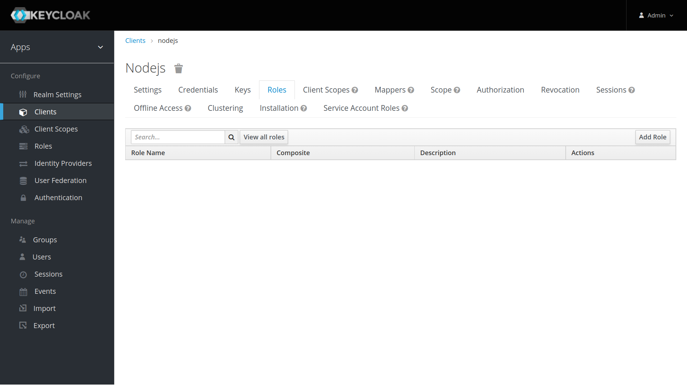

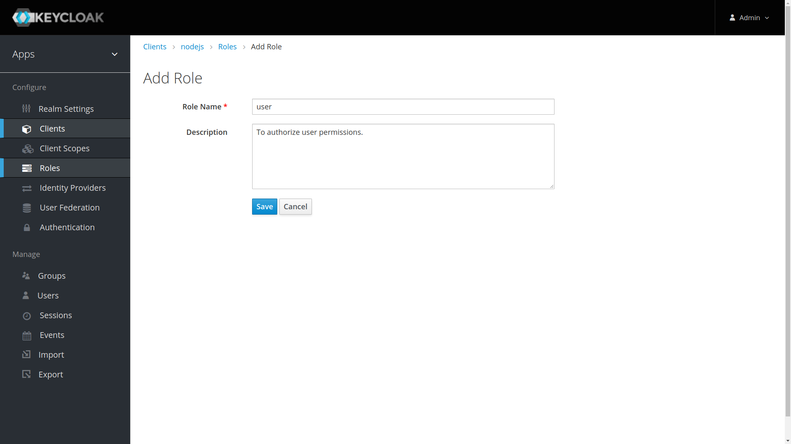


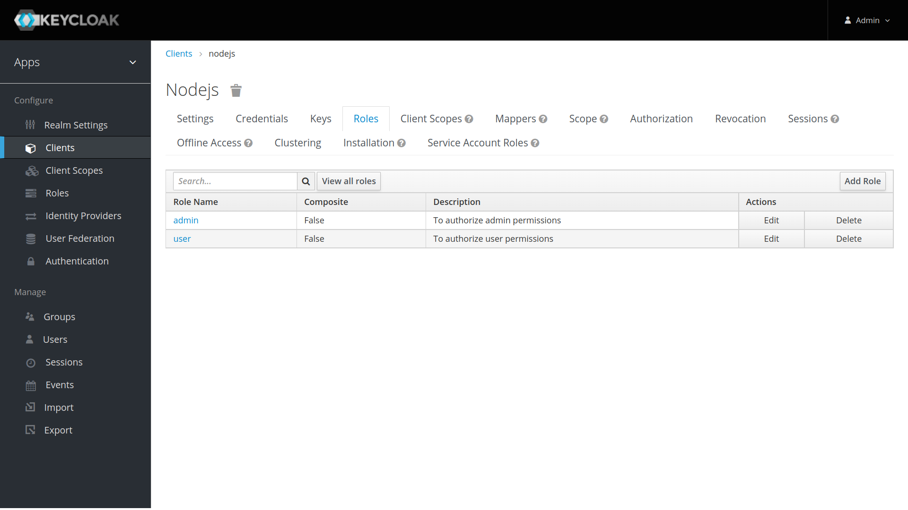

#### Create Next.js Client


After saving you will be presented with the client configuration page where you can assign a name and description to the client if desired.

Set the **Access Type** to `confidential`, **Authorization Enabled** to `ON`, `Service Account Enabled` to `ON` and click `Save`.

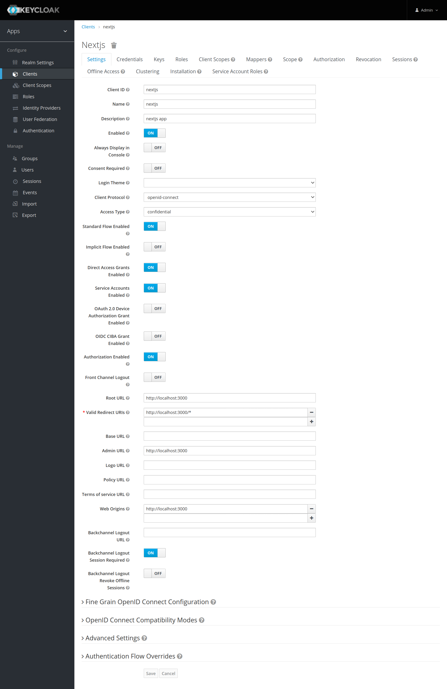

`Credentials` tab will show the `Client Secret` which is required for the Next Auth configurations.

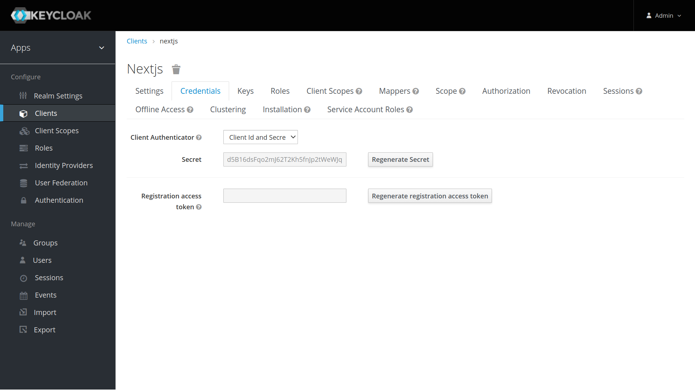

### Create Realm Roles

Applications often assign access and permissions to specific roles rather than individual users as dealing with users can be too fine grained and hard to manage.

Let’s create `app-user` and `app-admin` Realm roles by assigning corresponding `nodejs` roles (`user`, `admin`).

1. Click on the `Roles` menu from the left pane. All the available roles for the selected Realm will get listed here.

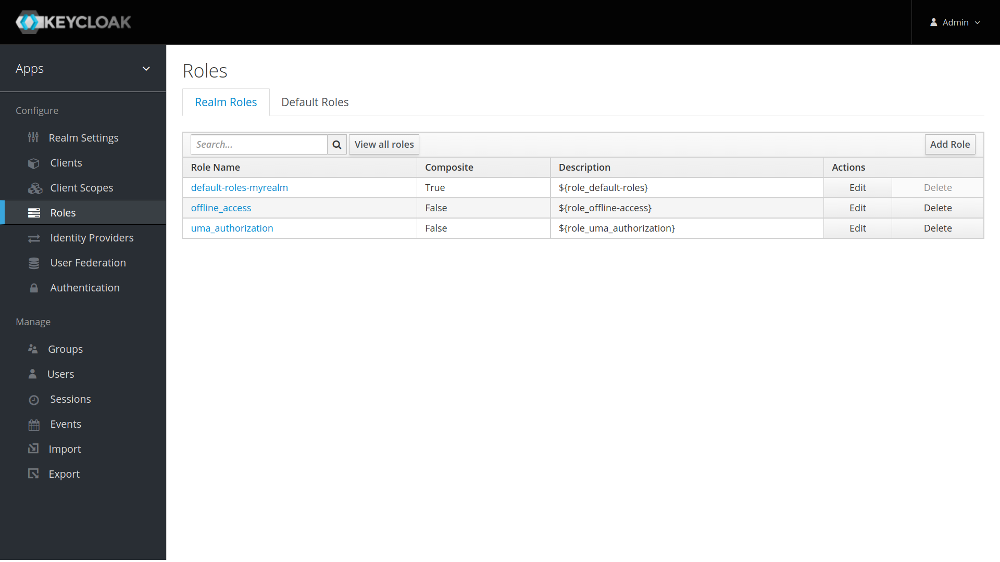

2. To create **app-user** realm role, click **Add Role**. You will be prompted for a **Role Name**, and a **Description**. Provide the details as below and **Save**.

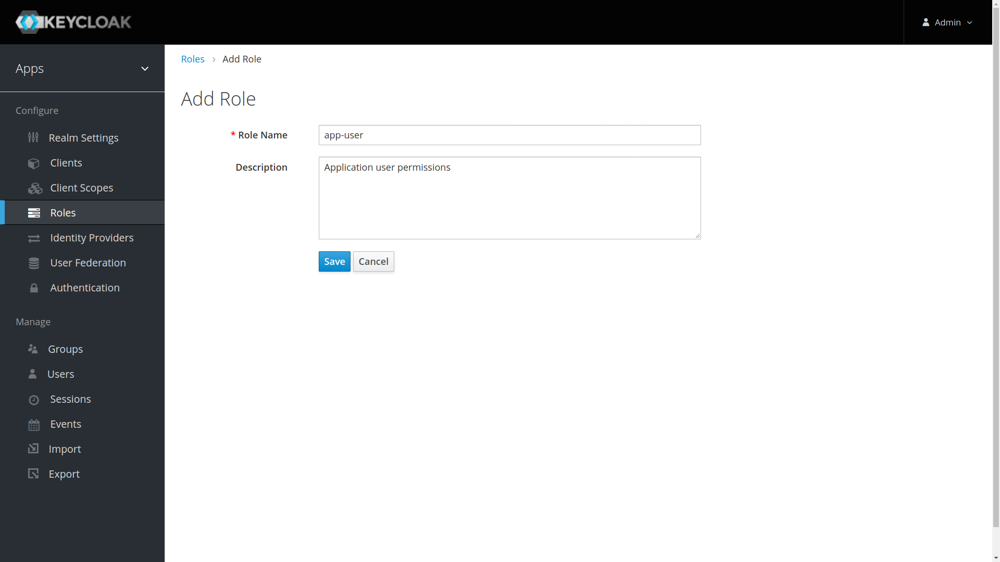

After **Save**, enabled **Composite Roles** and Search for **nodejs** under **Client Roles** field. Select **user** role of the **nodejs** and Click **Add Selected >**.

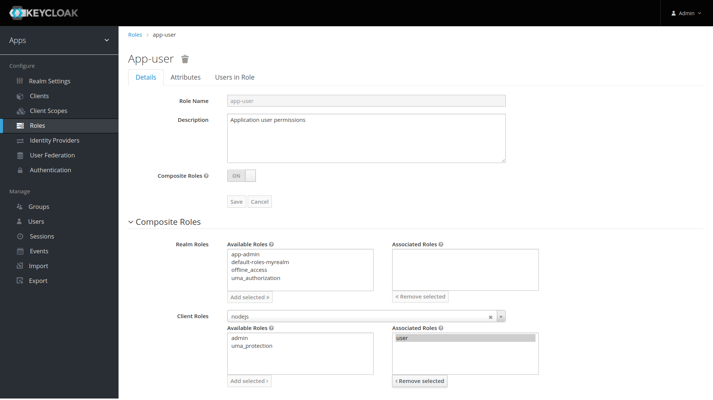

This configuration will assign **nodejs** **user** client role to the **app-user** realm role. If you have multiple clients with multiple roles, pick and choose the required roles from each client to create realm roles based on the need.

3. Follow the same steps to create the **app-admin** user but assign **admin** client role instead of **user** role.

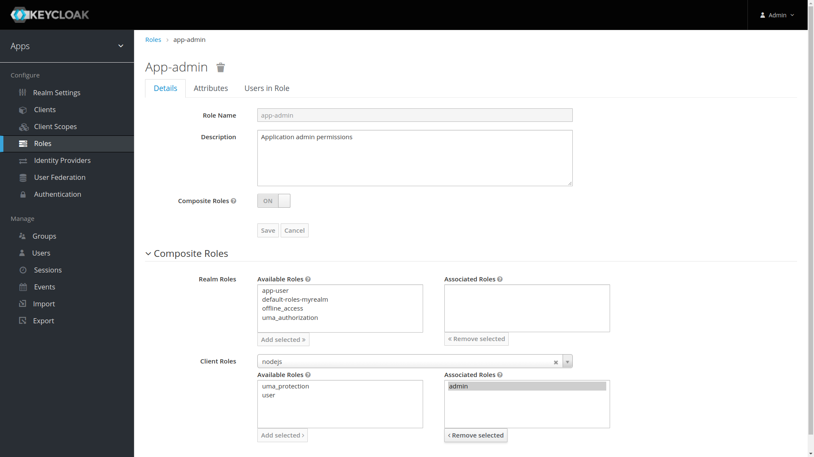

### Create Users

Users are entities that are able to log into your system. They can have attributes associated with themselves like email, username, address, phone number, and birth day. They can be assigned group membership and have specific roles assigned to them.

Let’s create following users and grant them `app-user` and `app-admin` roles for testing purposes.

- employee1 with `app-user` realm role
- employee2 with `app-admin` realm role
- employee3 with `app-user` & `app-admin` realm roles

1. From the menu, click `Users` to open the user list page.

2. On the right side of the empty user list, click `Add User` to open the add user page.

3. Enter a name in the `Username` field; this is the only required field. Flip the `Email Verified` switch from `Off` to `On` and click `Save` to save the data and open the management page for the new user.

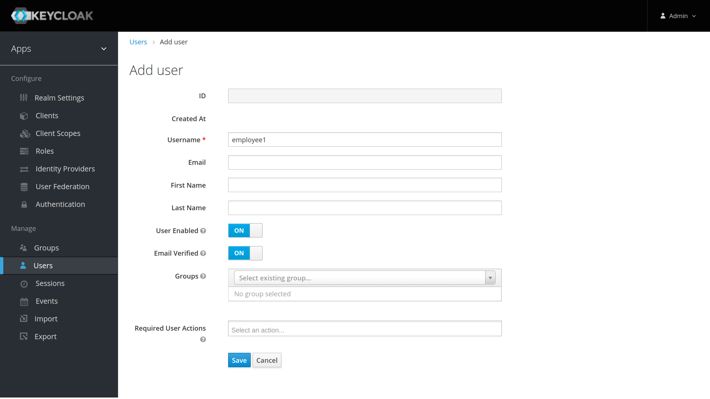

4. Click the `Credentials` tab to set a temporary password for the new user.

5. Type a new password and confirm it. Flip the `Temporary` switch from `On` to `Off` and click `Reset Password` to set the user password to the new one you specified. For simplicity let’s set the password to `mypassword` for all the users.

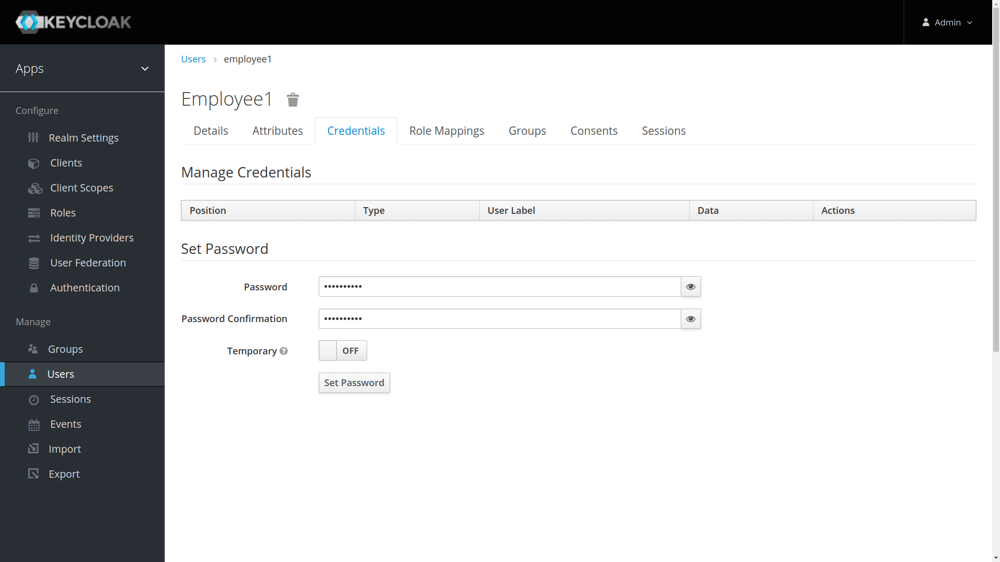

6. Click the `Role Mappings` tab to assign realm roles to the user. Realm roles list will be available in `Available Roles` list. Select one required role and click on the `Add Selected >` to assign it to the user.

After role assignment, assigned roles will be available under `Assigned Roles` list. Role assignments for `employee1`, `employee2`, and `employee3` would be as below.


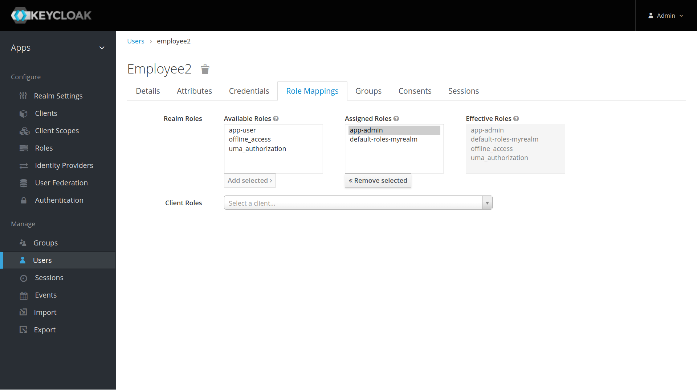
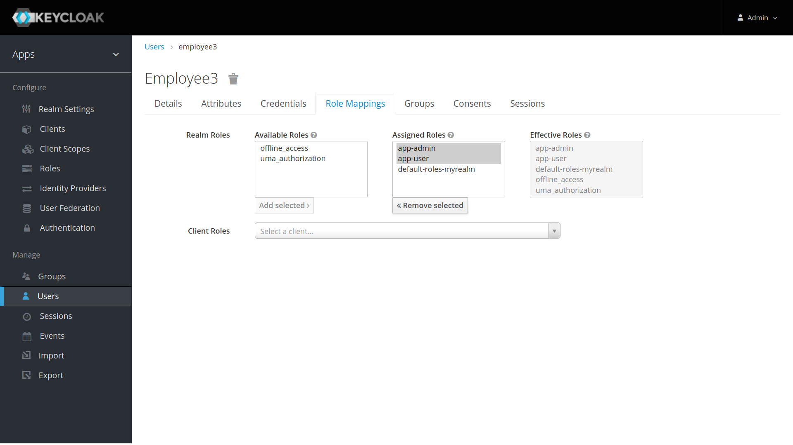

Yes, it was a bit of a hassle to go through all the configurations. But when you keep using Keycloak, these configurations will become a piece of cake. For new application getting added, you don’t need to do all of the above. You just need to add a new client with client roles and assign the client roles to corresponding realm roles.

### Generate Tokens

Let’s quickly test the authentication of some user created above and see if the tokens are being generated correctly.

1. Go to `Realm Settings` of the `apps` from the left menu and click on `OpenID Endpoint Configuration` to view OpenID Endpoint details.

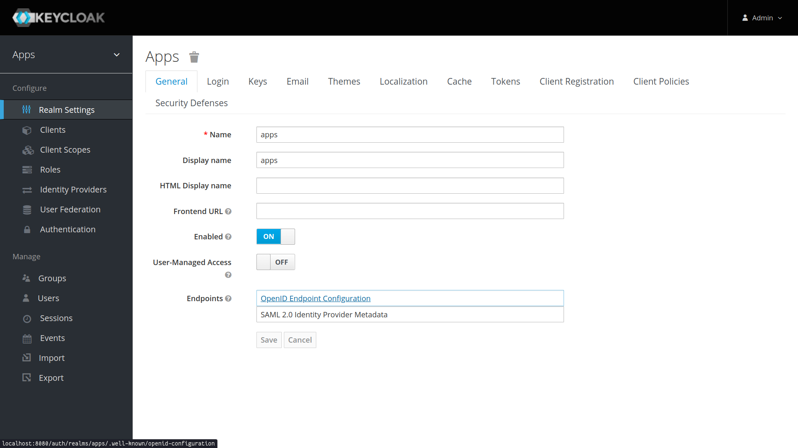
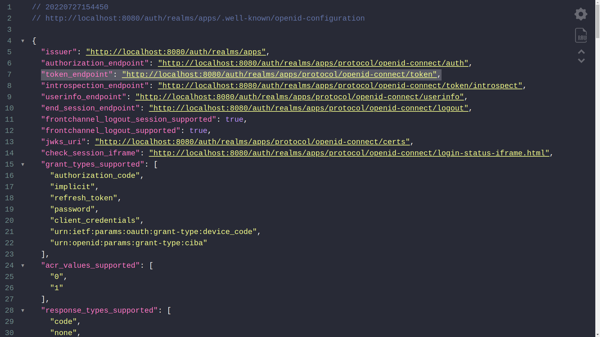

Keycloak Realm OpenID Endpoint Configuration

2. Copy `token_endpoint` from the `OpenID Endpoint Configuration`. URL would look like:

```
<KEYCLOAK_SERVER_URL>/auth/realms/<REALM_NAME>/protocol/openid-connect/token

Ex: http://localhost:8080/auth/realms/apps/protocol/openid-connect/token
```

3. Use the following CURL command to generate user credentials. Replace `KEYCLOAK_SERVER_URL`, `REALM_NAME`, `CLIENT_ID`, `USERNAME`, `PASSWORD` with correct values.

```
curl -X POST '<KEYCLOAK_SERVER_URL>/auth/realms/<REALM_NAME>/protocol/openid-connect/token' \
  --header 'Content-Type: application/x-www-form-urlencoded' \
  --data-urlencode 'grant_type=password' \
  --data-urlencode 'client_id=<CLIENT_ID>' \
  --data-urlencode 'username=<USERNAME>' \
  --data-urlencode 'password=<PASSWORD>'
```

Execute the CURL from Terminal or use Insomnia/Postman. The response would look like below.

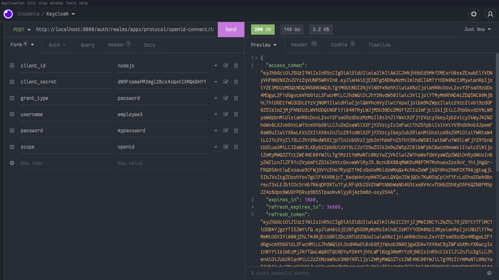

### Configure Token Expiration Time

To access this setting you need to go to: `Realm settings` and then `Tokens`.

You can change the expiration time of the tokens, by default the `access_token` has an expiration of `5min` and the `refresh_token` has an expiration of `30min`, you can increase this time if you want.

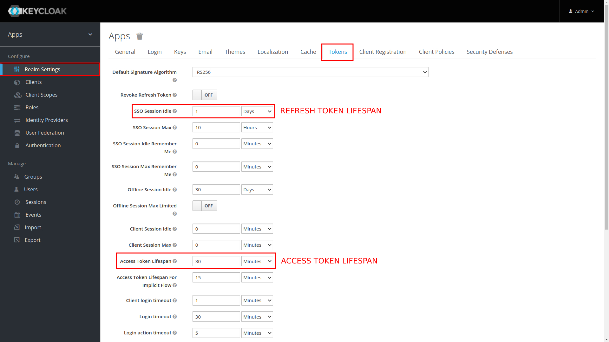

In this case, I have the following configuration:

- **access_token**: 30min
- **refresh_token**: 1day

</details>

<details>
<summary>
Node.js API
</summary>

This application is very simple, it has some endpoints that are protected with Keycloak, that is, the user to be able to consume that endpoint needs to be authenticated and have all the roles that the endpoint needs to access it.

### Endpoints

| METHOD | URL          | ROLE             | DESCRIPTION                                                                            |
| ------ | ------------ | ---------------- | -------------------------------------------------------------------------------------- |
| `GET`  | `/anonymous` | -                | Public endpoint without Keycloak protection                                            |
| `GET`  | `/user`      | `user`           | Secure endpoint with Keycloak and **user** role required to grant access               |
| `GET`  | `/admin`     | `admin`          | Secure endpoint with Keycloak and **admin** role required to grant access              |
| `GET`  | `/all-user`  | `user` + `admin` | Secure endpoint with Keycloak and **user** and **admin** role required to grant access |

### Run Node.js API

First install all dependencies

```bash
$ cd keycloak-nextjs-nodejs/nodejs
$ npm install
```

Now execute API

```bash
$ cd keycloak-nextjs-nodejs/nodejs
$ npm run dev
```

The API after running will be available on port 3333.

</details>

<details>
<summary>
Next.js App
</summary>

### Run Next.js App

First access the nextjs app folder

```bash
$ cd keycloak-nextjs-nodejs/nextjs
```

Install all dependencies

```bash
$ npm install
```

Configure environment variables, some variables where inserted, add a value to variable `KEYCLOAK_CLIENT_SECRET` from your **client** in Keycloak

```bash
$ cp .env.local.example .env.local
```

Now execute app

```bash
$ cd keycloak-nextjs-nodejs/nextjs
$ npm run dev
```

The app after running will be available on port 3000.

### Sign in page

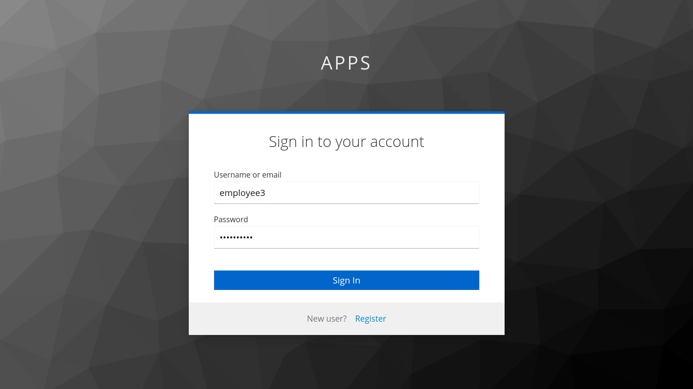

### Home page

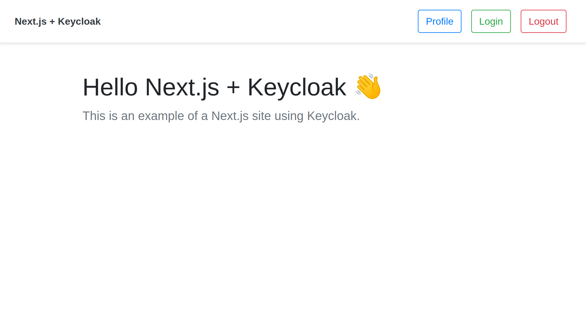

### Profile

Logged

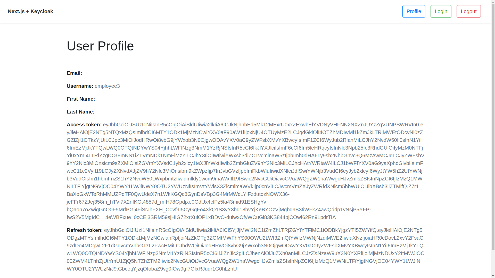

Logged out

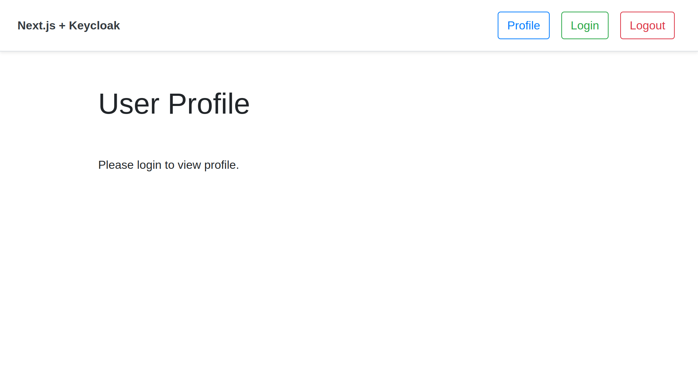

This application, when making a request to the API endpoints in Node.js, if the access token expires, an Axios interceptor was created to monitor and perform the auto refresh token and with that the call that failed due to the token being invalid will work.

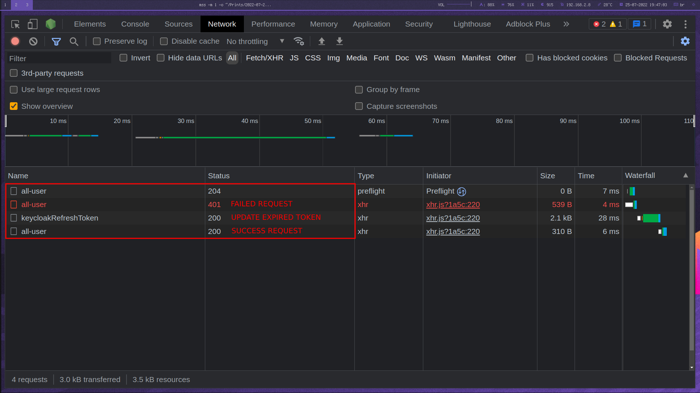

</details>
